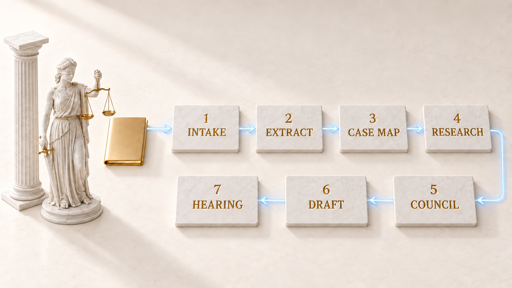

# Themiz

A working system for a Russian court case: source files, a case map, checked citations, a draft, and a separate review.

[Русский](README.ru.md) · [中文](README.zh.md)

[](LICENSE) [](https://github.com/zarubinvibe/themiz/stargazers) [](https://github.com/zarubinvibe/themiz) [](https://github.com/zarubinvibe/athena#olympuz-family)

<p align="center"></p>

<!-- owner-welcome:start -->

> Hello, I am Fil.
>
> I built Themiz because evenings kept disappearing into the mechanical part of a case: scans, dates, citations, and another pass through the same bundle. I wanted one workspace that remembers where a fact came from and says plainly when a check did not happen.
>
> Try it on a copy of a non-sensitive file first. If something breaks, open an issue with the command you ran and the result you saw. If it earns a place in your practice, star the repository and have a look at the other Olympuz projects: https://zarubinvibe.com
>
> — Filipp Zarubin

<!-- owner-welcome:end -->

## Contents

- [What This Is](#what-this-is)
- [Why It Helps](#why-it-helps)
- [The Main Advantage](#the-main-advantage)
- [How It Works](#how-it-works)
- [Quickstart](#quickstart)
- [Simple Comparison](#simple-comparison)
- [Simple Words](#simple-words)
- [Safety And Privacy](#safety-and-privacy)
- [Limits](#limits)
- [Star And Contribute](#star-and-contribute)

<!-- beginner-readme:start -->

## What This Is

Themiz is a workspace for lawyers handling disputes under Russian law. It keeps each matter in its own folder, reads local files, assembles the facts, searches approved sources, and carries a draft through review. You can run the same project with Codex CLI or Claude Code.

The public repository contains the engine, agents, tests, and safe templates. It does not contain a ready-made legal corpus or anyone's case files. You choose the sources, permissions, and model provider before using it with client material.

## Why It Helps

Case work gets buried under small, expensive chores: reading another scan, reconciling dates, finding the source of a quotation, checking whether the draft still matches the evidence. Themiz keeps those chores attached to one case and records what passed, what failed, and what still needs a lawyer.

It is built for Russian litigation. Its document contracts, statutory calculations, court terminology, and source routes follow Russian procedure; they are not a general legal system for every jurisdiction.

## The Main Advantage

**Main advantage:** a claim can keep its trail back to the file, source, and review status.

**Why this is better:** Code handles supported calculations such as statutory interest, procedural dates, court fees, and amounts in words. The citation tool reads from the corpus available on your disk, checks its checksum, and warns when freshness is missing or needs review. A model does not get to turn a paraphrase into a verified article.

## How It Works

The seven stages below are a working order, not seven mandatory swarms. A narrow matter with no more than six text or already recognised files can use the FAST route. A complex matter, disputed reading, or a large scan bundle uses FULL readers and reconciliation. The Pantheon scenes illustrate that order; they are not screenshots of the interface.

<!-- workflow-diagram:start -->

<p align="center"></p>

<!-- workflow-diagram:end -->

| Stage | What happens |
|---|---|
| 1. Intake | One local folder holds the original case material |
| 2. Extract | Local extraction routes text, scans, tables, and audio |
| 3. Case map | The case map connects facts, claims, evidence, and conflicts |
| 4. Research | Research records support, procedural options, and adverse authority |
| 5. Council | The council reviews the position and is required for L3 |
| 6. Draft | One role drafts; another reviews the same version |
| 7. Hearing | The hearing pack keeps the checklist, arguments, and deadlines together |

### Step 1: Hand over the case files

Copy the selected files into the case intake folder. The workflow treats originals as source material and keeps generated notes elsewhere. Repository publication rules exclude client case folders, but you still decide what text is sent to a model provider.

<p align="center"></p>

**You get:** a bounded case workspace with the source files kept apart from generated work.

### Step 2: Scans are read on your Mac

Text PDF, DOCX, PPTX, and XLSX go through local extractors. On macOS, Apple Vision handles scans and images; Whisper can transcribe audio when its local runtime and model are available. The router stores text and extracted details beside a content hash. Check case numbers, amounts, and critical details against the original.

<p align="center"></p>

**You get:** searchable local text with a recorded route and details that still carry a verification duty.

### Step 3: The case map is built

FAST lets one mapper read a narrow set of no more than six text or already recognised files. FULL assigns readers by format and then reconciles their reports when the bundle is large, scanned, or disputed. Missing and conflicting details stay visible instead of being filled in.

<p align="center"></p>

**You get:** a case map with sources, open conflicts, and a clear reading boundary.

### Step 4: Case law for and against

Research starts with local material and a channel check. FAST normally uses one tactical search. FULL can split the work across supportive, sceptical, and procedural tracks. External requests are depersonalised and use approved sources; if a source is unavailable, the result says so.

<p align="center"></p>

**You get:** a sourced research record that includes adverse material and named gaps.

### Step 5: Five jurists argue it out

For L2 and L3 matters, several legal roles examine the position from different angles and record disagreements. The council is required for L3. For L2 FAST, it may be skipped only when the lawyer has recorded their own position. The council organises arguments; it does not create independent providers or replace source verification.

<p align="center"></p>

**You get:** a position with its assumptions, objections, and weak points on the page.

### Step 6: One writes, another checks

The drafter works from the case contract and recorded sources. A separate reviewer checks facts, citations, position, form, and completeness, then records a controlled verdict. Mechanical guards can stop assembly when required evidence, review, format, or personal-data checks fail. They do not certify legal correctness.

<p align="center"></p>

**You get:** a reviewed draft and an explicit list of unresolved issues for the lawyer.

### Step 7: Hearing prep and reminders

The preparation role builds a hearing checklist from the case map and available positions. Status tools show missing steps and calculated dates with their rule where supported. Telegram reminders are optional. The lawyer checks the file, chooses what to submit, signs it, and appears in court.

<p align="center"></p>

**You get:** a preparation pack and visible open items, not an automatic filing decision.

## Quickstart

For the verified macOS path you need Python 3.11 or newer and Xcode Command Line Tools. Apple Vision scan recognition runs on macOS. Codex CLI and Claude Code are equal alternatives; use the one you have configured.

```bash
git clone https://github.com/zarubinvibe/themiz.git
cd themiz
bash install.sh
. .venv/bin/activate
```

The shared block only installs the project and activates its Python environment. Then choose one agent client. Do not run both commands as one setup sequence.

**Option A: Codex CLI**

```bash
codex
```

Ask Codex to set up Themiz for your practice.

**Option B: Claude Code**

```bash
claude
```

In Claude Code, run `/themiz-setup`.

To open the folder in an editor:

```bash
code .
```

First create the case with an agent. Replace `cases/client/case` with the actual path of an existing case folder. This command gives a summary of that specific case, not a general runtime overview:

```bash
python3 scripts/themiz_status.py cases/client/case --brief
```

The optional browser cockpit starts with:

```bash
.venv/bin/python cockpit/app.py
```

The cockpit opens locally at `http://127.0.0.1:8800`. Its agent actions currently call Claude Code; for Codex work, use Codex CLI or your editor. No Git? Download the [ZIP](https://github.com/zarubinvibe/themiz/archive/refs/heads/main.zip) and follow the same install steps.

Never done this before? [The onboarding](docs/ONBOARDING.md) walks the whole first run step by step and says what you see after every command.

**You get:** an installed workspace with both CLI configurations, safe starter templates, and a status command. Configure your model access and approved legal sources before opening a live case.

## Simple Comparison

| Product | Purpose | Legal sources | Case documents | Drafting | Review |
|---|---|---|---|---|---|
| **Themiz** | Workflow for a Russian court case | Local corpus and approved external sources, with source status | Local extraction; you decide what the chosen model provider receives | Procedural documents under the case contract | Separate reviewer and mechanical gates; the lawyer decides whether to file |
| Manual work | A lawyer works from the case folder | The lawyer checks primary sources | The lawyer reads the originals | The lawyer writes | Full responsibility stays with the lawyer |
| [ConsultantPlus](https://www.consultant.ru/about/software/cons/) | Russian legal reference system | Legislation, case law, and commentary | Documents supplied by the system; arbitrary case-file upload was not verified | Contract and local-document tools depend on the package | The system flags risks; the user chooses |
| [Garant](https://udalenka.garant.ru/) | Legal information and support | Legal database, encyclopaedia, and expert materials | Document and approval tools depend on the connected services | Not confirmed on the reviewed product page | Organisation and expert help; the user decides |
| [ChatGPT](https://help.openai.com/en/articles/9260256) | General AI assistant | Search and deep research depend on settings and plan; no dedicated Russian-law corpus is claimed here | Supports uploaded PDFs, presentations, and text files | Drafting, rewriting, and summarising | No legal acceptance is claimed; the user reviews the result |
| [Claude](https://claude.com/product/overview) | General AI assistant | Web search and connections are available by setup; no dedicated Russian-law corpus is claimed here | Works with PDFs, Word, Excel, and images | Drafting, editing, and polishing | Can evaluate a draft; legal certification is not claimed and the user remains in control |

Product names belong to their owners. This is a scope map, not a benchmark. Features and access can vary by service, plan, region, and configuration; follow the linked product pages for current details.

## Simple Words

| Word | Simple meaning |
|---|---|
| Repository | The project folder that Git stores and versions |
| Terminal | The window where you type commands |
| Command | One instruction you give the computer |
| Branch | A separate line of changes that does not touch `main` |
| Pull Request | A request to review your change and accept it |
| Case map | A file that connects parties, dates, claims, evidence, and open conflicts |
| Agent | An assistant role with one bounded job, such as reading a document or reviewing a draft |
| LKG | The last known good local copy, kept readable when a source refresh fails |

## Safety And Privacy

- Files, OCR, extraction caches, and the case workspace stay on your computer. Text sent to an agent is processed under the terms of your chosen model provider; set that boundary before using client material.
- The public release excludes case folders and the private legal corpus. A personal-data guard checks commits for known patterns, which reduces accidental publication risk but cannot prove that every possible leak is impossible.
- External legal research uses approved channels and a depersonalised query rather than the case file. A cloud check of a difficult page requires an explicit fallback; there is no silent switch from local OCR.
- Telegram is optional and off until you configure your own bot. Once enabled, permitted reminder data leaves your computer for Telegram.
- Mechanical checks cover supported formats, checksums, calculations, and workflow states. They do not certify the law, the evidence, or the final litigation decision.

Before using a shared computer or sending client text to a model, read [SECURITY.md](SECURITY.md) and set the permissions for your practice.

## Limits

Themiz is in development and is designed for work under a lawyer's control. Codex CLI and Claude Code are equal launch paths. The technical contracts and a clean macOS installation are tested; an end-to-end court matter and clean Windows or Linux installation are not certified.

- Apple Vision recognition for scans and images works on macOS only. Text formats use Python tools, but the complete Windows and Linux setup has not been verified.
- DOCX, text PDF, PPTX, and XLSX conversion passed isolated cold-install checks. Legacy XLS has a configured reader but did not receive the same synthetic conversion check.
- Legal research and corpus refresh depend on external sources. An unavailable source remains unavailable; it is not replaced with a model guess.
- The public clone starts with the engine and templates, not a populated legal corpus. After local data is present, Themiz can build a separate legal graph with source and freshness markers. The bundled Graphify files describe the codebase, not your legal corpus.
- The background loader checks approved public sources independently of model subscription quotas. It keeps the last known good local copy when a refresh fails. Weekly maintenance uses factual Codex reset events for its own cycle and does not impose USD caps or manage every provider's plan.
- Local OCR, extraction, calculations, and background downloads do not require a paid model API call. Agent analysis still uses the account or subscription of the model provider you choose.
- A separate reviewer and a green workflow status do not make a document court-ready. You verify the facts and law, decide whether to file, sign the document, and remain responsible for the case.

Read [how the workflow works](docs/HOW-IT-WORKS.ru.md) and the [agent reference](docs/DETAILS.md). Both explain the machinery in more detail; the workflow guide is currently in Russian.

## Star And Contribute

Useful? Give Themiz a star: [https://github.com/zarubinvibe/themiz](https://github.com/zarubinvibe/themiz). It takes a second and it decides whether other people ever find the project.

Want to change something? The path is short: fork the repository, create a branch, commit your change, push the branch, then open a Pull Request. Do not push directly to `main`.

Found a problem instead? Open an issue at [https://github.com/zarubinvibe/themiz/issues](https://github.com/zarubinvibe/themiz/issues) and say what you ran and what happened.

<!-- beginner-readme:end -->

<!-- pantheon-family:start -->
## Olympuz family

This is one of the public [Olympuz projects](https://github.com/zarubinvibe/athena#olympuz-family). Each row opens the repository or downloads its source as a ZIP.

| Type | Name | What it does | How it helps this house | Source |
|---|---|---|---|---|
| project | Athena | Portable agent OS that restores a complete Claude and Codex setup on a new Mac. | Deploys the agent workspace on a new machine in one run: rules, skills, hooks. | [Repository](https://github.com/zarubinvibe/athena) · [ZIP](https://github.com/zarubinvibe/athena/archive/refs/heads/main.zip) |
| project | Helioz | 24/7 agent work conveyor with verified completion markers and goal-based overnight decisions. | Runs agent work around the clock and closes every task with a verifiable marker. | [Repository](https://github.com/zarubinvibe/helioz) · [ZIP](https://github.com/zarubinvibe/helioz/archive/refs/heads/main.zip) |
| project | Mnemazine | Local-first memory system that turns raw inputs into verified reusable knowledge. | Turns raw material — screenshots, PDFs, links — into verified knowledge notes. | [Repository](https://github.com/zarubinvibe/mnemazine) · [ZIP](https://github.com/zarubinvibe/mnemazine/archive/refs/heads/main.zip) |
| project | Themiz | Multi-agent assistant for Russian litigation with local OCR and review by a five-jurist council. | Runs Russian court cases with multiple agents and local storage of case material. | [Repository](https://github.com/zarubinvibe/themiz) · [ZIP](https://github.com/zarubinvibe/themiz/archive/refs/heads/main.zip) |
| project | Zeuz | Factory that turns an idea into a governed multi-agent workflow with gates, observability, and replay. | Builds a multi-agent workflow with rules, gates, observability and replay. | [Repository](https://github.com/zarubinvibe/zeuz) · [ZIP](https://github.com/zarubinvibe/zeuz/archive/refs/heads/main.zip) |
| project | Lynceuz | Collects public web evidence at zero cost and stops with an honest reason when the safe routes end. | Collects evidence from the open web at zero cost and stops honestly at the boundary. | [Repository](https://github.com/zarubinvibe/lynceuz) · [ZIP](https://github.com/zarubinvibe/lynceuz/archive/refs/heads/main.zip) |
| project | Iriz | macOS menu-bar dictation that decodes speech on your own Mac, fixes wrong keyboard layouts, and turns dictation into a ready task for an agent. | Menu-bar dictation on macOS: speech is decoded on your Mac and the keyboard layout fixes itself. | [Repository](https://github.com/zarubinvibe/iriz) · [ZIP](https://github.com/zarubinvibe/iriz/archive/refs/heads/main.zip) |
| project | Mantoz | Puts an idea in front of five hundred people who do not exist, then shows how each group answered. | Puts an idea in front of hundreds of generated people before real ones see it. | [Repository](https://github.com/zarubinvibe/mantoz) · [ZIP](https://github.com/zarubinvibe/mantoz/archive/refs/heads/main.zip) |
| project | Koiz | A single lesson base for every project. Each failure is taken down to its cause, and the cause stays open until a hook, a gate or a test closes it. | Keeps one lesson base for every project and demands a mechanism, not a promise. | [Repository](https://github.com/zarubinvibe/koiz) · [ZIP](https://github.com/zarubinvibe/koiz/archive/refs/heads/main.zip) |
<!-- pantheon-family:end -->

## License

Themiz Community Licence 1.0 permits free use by an individual lawyer, including private practice. Organisations need a commercial licence. Model subscriptions and third-party services are separate. See [LICENSE](LICENSE) and [LICENSE.ru.md](LICENSE.ru.md).
