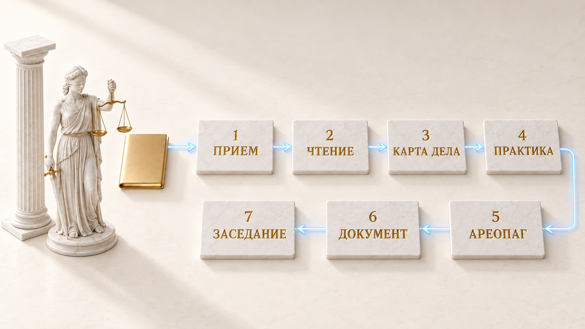

# Themiz

Рабочая система для российского судебного дела: исходники, карта фактов, проверяемые цитаты, черновик и отдельная рецензия.

[English](README.md) · [中文](README.zh.md)

[](LICENSE) [](https://github.com/zarubinvibe/themiz/stargazers) [](https://github.com/zarubinvibe/themiz) [](https://github.com/zarubinvibe/athena#olympuz-family)

<p align="center"></p>

<!-- owner-welcome:start -->

> Привет, я Фил.
>
> Я сделал Themiz, потому что вечера уходили на механику дела: сканы, даты, ссылки и новый проход по той же папке. Хотелось одного рабочего места, которое помнит источник факта и прямо говорит, когда проверка не состоялась.
>
> Сначала попробуй проект на копии файла без чувствительных данных. Если что-то сломается, открой issue и приложи команду с результатом. Если Themiz приживется в твоей практике, поставь репозиторию звезду и загляни в другие проекты Olympuz: https://zarubinvibe.ru
>
> — Филипп Зарубин

<!-- owner-welcome:end -->

## Оглавление

- [Что это](#что-это)
- [Зачем это нужно](#зачем-это-нужно)
- [Главное преимущество](#главное-преимущество)
- [Как это работает](#как-это-работает)
- [Быстрый старт](#быстрый-старт)
- [Простое сравнение](#простое-сравнение)
- [Простые слова](#простые-слова)
- [Безопасность и приватность](#безопасность-и-приватность)
- [Ограничения](#ограничения)
- [Звезда и вклад](#звезда-и-вклад)

<!-- beginner-readme:start -->

## Что это

Themiz помогает юристу вести споры по российскому праву. Каждое дело живет в своей папке: проект читает локальные файлы, собирает факты, ищет по разрешенным источникам и проводит черновик через отдельную рецензию. Запустить тот же проект можно через Codex CLI или Claude Code.

Публичный репозиторий содержит движок, агентов, тесты и безопасные шаблоны. Готового нормативного корпуса и чужих дел там нет. До работы с материалами доверителя ты сам выбираешь источники, разрешения и поставщика модели.

## Зачем это нужно

Судебное дело быстро вязнет в мелкой, дорогой работе: прочитать еще один скан, свести даты, найти источник цитаты, проверить черновик по доказательствам. Themiz держит эти действия внутри одного дела и показывает, что прошло проверку, где случился сбой и что осталось юристу.

Проект сделан для российской судебной практики. Контракты документов, расчетные приборы, терминология и маршруты источников опираются на российский процесс. Это не универсальная правовая система для любой юрисдикции.

## Главное преимущество

**Главное преимущество:** у факта и цитаты остается путь к исходнику, источнику и статусу проверки.

**Почему это лучше:** Код считает поддерживаемые величины: проценты, процессуальные сроки, госпошлину и сумму прописью. Цитатор берет норму из корпуса на твоем диске, сверяет контрольную сумму и предупреждает, если свежесть не доказана. Пересказ модели не превращается в проверенный текст статьи.

## Как это работает

Семь шагов ниже задают порядок работы, а не семь обязательных роев. Для узкого вопроса и не более шести текстовых или уже распознанных файлов подходит FAST. Сложный спор, неоднозначное чтение или большая пачка сканов требует FULL с отдельными читателями и сверкой. Сцены Pantheon показывают последовательность; это иллюстрации, а не снимки интерфейса.

<!-- workflow-diagram:start -->

<p align="center"></p>

<!-- workflow-diagram:end -->

| Этап | Что происходит |
|---|---|
| 1. Прием | Исходные материалы лежат в отдельной папке дела |
| 2. Чтение | Локальный роутер читает текст, сканы, таблицы и аудио |
| 3. Карта дела | Карта связывает факты, требования, доказательства и конфликты |
| 4. Практика | Поиск собирает поддержку, процессуальные ходы и практику против позиции |
| 5. Ареопаг | Совет разбирает позицию; на L3 он обязателен |
| 6. Документ | Одна роль пишет, другая проверяет ту же версию |
| 7. Заседание | Пакет к заседанию держит вместе чеклист, доводы и сроки |

### Шаг 1: Передай материалы дела

Скопируй нужные файлы во входящую папку дела. Workflow считает их исходниками и хранит рабочие заметки отдельно. Правила публикации исключают папки доверителей, но границу передачи текста поставщику модели задаешь ты.

<p align="center"></p>

**Что получится:** ограниченная рабочая папка дела, где исходники отделены от результатов.

### Шаг 2: Сканы читаются на твоем Mac

Текстовые PDF, DOCX, PPTX и XLSX идут через локальные экстракторы. На macOS сканы и изображения читает Apple Vision; Whisper расшифровывает аудио, если доступны локальный runtime и модель. Роутер сохраняет текст и реквизиты рядом с хешем содержимого. Номера дел, суммы и критичные данные сверь с оригиналом.

<p align="center"></p>

**Что получится:** текст для поиска с записанным маршрутом и реквизитами, которые еще надо проверить по исходнику.

### Шаг 3: Строится карта дела

В FAST один картограф читает узкий набор: не более шести текстовых или уже распознанных файлов. В FULL материалы делятся между читателями по формату, а их отчеты сверяются, если папка большая, в ней много сканов или чтение спорное. Пропуски и расхождения остаются видимыми.

<p align="center"></p>

**Что получится:** карта дела с источниками, открытыми конфликтами и понятной границей чтения.

### Шаг 4: Практика за твою позицию и против нее

Сначала проверяются локальные материалы и доступность каналов. FAST обычно использует одного тактического охотника. FULL делит поиск на поддерживающий, скептический и процессуальный треки. Наружу уходит обезличенный запрос по разрешенному источнику; если источник недоступен, это записывается в результат.

<p align="center"></p>

**Что получится:** подборка с источниками, неблагоприятной практикой и названными пробелами.

### Шаг 5: Пятеро правоведов спорят

На уровне L2 и L3 несколько правовых ролей разбирают позицию с разных сторон и записывают разногласия. На L3 совет обязателен. На L2 FAST его можно пропустить, только если юрист зафиксировал свою позицию. Совет упорядочивает аргументы, но не создает независимых поставщиков и не заменяет проверку источников.

<p align="center"></p>

**Что получится:** позиция, где видны допущения, возражения и слабые места.

### Шаг 6: Один пишет, другой проверяет

Составитель работает по контракту дела и записанным источникам. Отдельный рецензент проверяет факты, цитаты, позицию, форму и полноту, затем фиксирует вердикт из закрытого списка. Механические гейты останавливают сборку при сбое доказательств, рецензии, формата или проверки ПД. Юридическую правильность они не удостоверяют.

<p align="center"></p>

**Что получится:** проверенный черновик и явный список вопросов, которые остались юристу.

### Шаг 7: Подготовка к заседанию и напоминания

Роль подготовки собирает чеклист по карте дела и доступным позициям. Прибор статуса показывает пропущенные шаги, а поддерживаемые сроки считаются со ссылкой на правило. Telegram-напоминания необязательны. Ты проверяешь комплект, выбираешь, что подать, подписываешь документ и идешь в суд.

<p align="center"></p>

**Что получится:** пакет подготовки и видимые открытые вопросы, а не автоматическое решение о подаче.

## Быстрый старт

Для проверенного пути на macOS нужны Python 3.11 или новее и Xcode Command Line Tools. Распознавание сканов через Apple Vision работает на macOS. Codex CLI и Claude Code равноправны: выбери настроенный клиент.

```bash
git clone https://github.com/zarubinvibe/themiz.git
cd themiz
bash install.sh
. .venv/bin/activate
```

Общий блок только устанавливает проект и включает его Python-окружение. Дальше выбери один агентный клиент. Не запускай обе команды как части одной установки.

**Вариант A: Codex CLI**

```bash
codex
```

Попроси Codex настроить Themiz под твою практику.

**Вариант B: Claude Code**

```bash
claude
```

В Claude Code запусти `/themiz-setup`.

Открыть папку в редакторе:

```bash
code .
```

Сначала создай дело с агентом. Вместо `cases/client/case` подставь фактический путь существующей папки дела. Эта команда дает сводку конкретного дела, а не общий обзор состояния программы:

```bash
python3 scripts/themiz_status.py cases/client/case --brief
```

Необязательная панель в браузере:

```bash
.venv/bin/python cockpit/app.py
```

Панель откроется локально на `http://127.0.0.1:8800`. Ее агентные действия пока вызывают Claude Code; для работы через Codex используй Codex CLI или редактор. Нет Git? Скачай [ZIP](https://github.com/zarubinvibe/themiz/archive/refs/heads/main.zip) и выполни те же шаги.

Делаешь это впервые? [Онбординг](docs/ONBOARDING.ru.md) проводит весь первый запуск по шагам и говорит, что видно после каждой команды.

**Что получится:** установленная рабочая папка с конфигурациями обоих CLI, безопасными начальными шаблонами и командой статуса. До живого дела настрой доступ к модели и разрешенные правовые источники.

## Простое сравнение

| Продукт | Назначение | Правовые источники | Материалы дела | Черновик | Проверка |
|---|---|---|---|---|---|
| **Themiz** | Workflow российского судебного дела | Локальный корпус и разрешенные внешние источники со статусом | Локальное извлечение; ты решаешь, что получит поставщик модели | Процессуальные документы по контракту дела | Отдельный рецензент и механические гейты; решение о подаче принимает юрист |
| Работа вручную | Юрист работает с папкой дела | Юрист сам сверяет первоисточники | Юрист читает оригиналы | Юрист пишет сам | Полный контроль и ответственность юриста |
| [КонсультантПлюс](https://www.consultant.ru/about/software/cons/) | Справочная правовая система | Законодательство, практика и комментарии | Документы системы; произвольная загрузка дела не подтверждена | Конструктор договоров и локальных документов зависит от комплекта | Система подсвечивает риски; решение принимает пользователь |
| [ГАРАНТ](https://udalenka.garant.ru/) | Правовое обеспечение | Правовая база, Энциклопедия и экспертные материалы | Работа с документами и согласованием зависит от подключенных сервисов | На проверенной странице не подтвержден | Организация работы и экспертная помощь; решение принимает пользователь |
| [ChatGPT](https://help.openai.com/en/articles/9260256) | Универсальный AI-помощник | Search и deep research зависят от настроек и тарифа; специальный корпус права РФ здесь не заявлен | Принимает PDF, презентации и текстовые файлы | Пишет, переписывает и сокращает | Юридическая приемка не заявлена; результат проверяет пользователь |
| [Claude](https://claude.com/product/overview) | Универсальный AI-помощник | Веб-поиск и подключения зависят от настройки; специальный корпус права РФ здесь не заявлен | Работает с PDF, Word, Excel и изображениями | Пишет и редактирует | Может оценить черновик, но не сертифицирует право; контроль остается у пользователя |

Названия принадлежат их владельцам. Это карта назначения, а не рейтинг. Возможности и доступ зависят от сервиса, тарифа, региона и настройки; актуальные условия смотри на страницах по ссылкам.

## Простые слова

| Слово | Простое значение |
|---|---|
| Repository | Папка проекта, которую хранит и версионирует Git |
| Terminal | Окно, куда ты вводишь команды |
| Command | Одна инструкция, которую ты даешь компьютеру |
| Branch | Отдельная линия изменений, которая не трогает `main` |
| Pull Request | Просьба проверить твое изменение и принять его |
| Карта дела | Файл, который связывает стороны, даты, требования, доказательства и открытые противоречия |
| Агент | Роль с одной ограниченной задачей: например, прочитать документ или проверить черновик |
| LKG | Последняя рабочая локальная копия, доступная даже после сбоя обновления источника |

## Безопасность и приватность

- Файлы, OCR, кеш извлечения и рабочая папка дела остаются на твоем компьютере. Текст, который ты передаешь агенту, обрабатывает выбранный поставщик модели по своим условиям; задай эту границу до работы с материалами доверителя.
- Публичная версия исключает папки дел и частный нормативный корпус. ПД-сторож ищет известные шаблоны в коммитах и снижает риск случайной публикации, но не доказывает невозможность любой утечки.
- Внешний поиск практики идет по разрешенным каналам с обезличенным запросом, а не с материалами дела. Облачная проверка сложной страницы требует явного перехода; локальный OCR не переключается в облако молча.
- Telegram необязателен и выключен, пока ты не настроишь своего бота. После включения разрешенные данные напоминаний уходят в Telegram.
- Механические проверки охватывают поддерживаемые форматы, контрольные суммы, расчеты и статусы workflow. Они не удостоверяют право, доказательства и итоговое решение по спору.

Перед работой на общем компьютере или передачей текста доверителя модели прочитай [SECURITY.ru.md](SECURITY.ru.md) и задай правила для своей практики.

## Ограничения

Themiz развивается и рассчитан на работу под контролем юриста. Codex CLI и Claude Code равноправны. Технические контракты и чистая установка на macOS проверяются тестами; полный судебный E2E и чистая установка на Windows или Linux не сертифицированы.

- Apple Vision распознает сканы и изображения только на macOS. Текстовые форматы читают Python-инструменты, но полная установка на Windows и Linux не проверена.
- DOCX, текстовый PDF, PPTX и XLSX прошли отдельные проверки после чистой установки. Для старого XLS настроен reader, но такой же синтетической конвертации не было.
- Поиск практики и обновление корпуса зависят от внешних источников. Недоступный источник остается недоступным, модель не подменяет его догадкой.
- Публичный клон содержит движок и шаблоны, а не заполненный нормативный корпус. Когда локальные данные появились, Themiz строит отдельный правовой граф с источниками и отметками свежести. Поставляемый Graphify-граф описывает код проекта, а не твой корпус.
- Фоновый загрузчик проверяет разрешенные публичные источники независимо от квоты модели и сохраняет последнюю рабочую копию при сбое. Недельное обслуживание использует фактические события сброса Codex для своего цикла, не вводит лимиты в долларах и не управляет тарифами всех поставщиков.
- Локальные OCR, извлечение, расчеты и фоновые загрузки не требуют отдельного платного вызова API модели. Агентный анализ использует аккаунт или подписку выбранного поставщика.
- Отдельная рецензия и зеленый статус workflow не делают документ готовым к суду автоматически. Ты сверяешь факты и право, принимаешь решение о подаче, подписываешь документ и отвечаешь за дело.

Подробности: [как устроен workflow](docs/HOW-IT-WORKS.ru.md) и [справочник агентов](docs/DETAILS.ru.md).

## Звезда и вклад

Пригодилось? Поставь Themiz звезду: [https://github.com/zarubinvibe/themiz](https://github.com/zarubinvibe/themiz). Это секунда, а от нее зависит, найдут ли проект другие люди.

Хочешь что-то поправить? Путь короткий: сделай fork, заведи ветку, оформи commit, отправь push и открой Pull Request. Не отправляй push прямо в `main`.

Нашел ошибку? Заведи issue на [https://github.com/zarubinvibe/themiz/issues](https://github.com/zarubinvibe/themiz/issues) и напиши, что запускал и что получилось.

<!-- beginner-readme:end -->

<!-- pantheon-family:start -->
## Семья Olympuz

Это один из публичных [проектов семьи Olympuz](https://github.com/zarubinvibe/athena#olympuz-family). Из таблицы можно открыть репозиторий или сразу скачать исходники в ZIP.

| Тип | Название | Что внутри | Чем помогает этому дому | Скачать |
|---|---|---|---|---|
| проект | Athena | Переносимая агентная ОС: разворачивает рабочую среду Claude и Codex на новом Mac. | Разворачивает рабочую среду агента на новой машине: правила, скиллы, хуки — за один прогон. | [Репозиторий](https://github.com/zarubinvibe/athena) · [ZIP](https://github.com/zarubinvibe/athena/archive/refs/heads/main.zip) |
| проект | Helioz | Конвейер работы агентов 24/7 с проверяемыми отметками готовности и ночными решениями по цели владельца. | Гоняет работу агентов круглосуточно и закрывает каждую задачу проверяемой отметкой. | [Репозиторий](https://github.com/zarubinvibe/helioz) · [ZIP](https://github.com/zarubinvibe/helioz/archive/refs/heads/main.zip) |
| проект | Mnemazine | Локальная система памяти: превращает сырье в проверенные знания для повторного использования. | Превращает сырье — скриншоты, PDF, ссылки — в проверенные заметки базы знаний. | [Репозиторий](https://github.com/zarubinvibe/mnemazine) · [ZIP](https://github.com/zarubinvibe/mnemazine/archive/refs/heads/main.zip) |
| проект | Themiz | Многоагентный помощник по российским судебным делам с локальным OCR и советом из пяти юристов. | Ведет российские судебные дела многоагентно, с локальным хранением материалов. | [Репозиторий](https://github.com/zarubinvibe/themiz) · [ZIP](https://github.com/zarubinvibe/themiz/archive/refs/heads/main.zip) |
| проект | Zeuz | Фабрика многоагентных workflow: собирает систему с правилами, гейтами, наблюдаемостью и replay. | Собирает многоагентный workflow с правилами, воротами, наблюдаемостью и повтором прогона. | [Репозиторий](https://github.com/zarubinvibe/zeuz) · [ZIP](https://github.com/zarubinvibe/zeuz/archive/refs/heads/main.zip) |
| проект | Lynceuz | Собирает доказательства из открытого веба за ноль рублей и честно останавливается, когда безопасные пути кончились. | Собирает доказательства из открытого веба бесплатно и честно останавливается на границе. | [Репозиторий](https://github.com/zarubinvibe/lynceuz) · [ZIP](https://github.com/zarubinvibe/lynceuz/archive/refs/heads/main.zip) |
| проект | Iriz | Диктовка в строке меню macOS: речь разбирается на твоем Маке, раскладка чинится сама, надиктовка превращается в готовое задание для агента. | Диктовка в строке меню macOS: речь разбирается на твоем Маке, раскладка чинится сама. | [Репозиторий](https://github.com/zarubinvibe/iriz) · [ZIP](https://github.com/zarubinvibe/iriz/archive/refs/heads/main.zip) |
| проект | Mantoz | Ставит идею перед пятьюстами людьми, которых не существует, и показывает, как ответила каждая группа. | Ставит идею перед сотнями сгенерированных людей до того, как ее увидят живые. | [Репозиторий](https://github.com/zarubinvibe/mantoz) · [ZIP](https://github.com/zarubinvibe/mantoz/archive/refs/heads/main.zip) |
| проект | Koiz | Одна база уроков на все проекты. Каждый провал доводится до причины, и причина висит открытой, пока ее не закроет хук, ворота или тест. | Держит одну базу уроков на все проекты и требует механизм, а не обещание. | [Репозиторий](https://github.com/zarubinvibe/koiz) · [ZIP](https://github.com/zarubinvibe/koiz/archive/refs/heads/main.zip) |
<!-- pantheon-family:end -->

## Лицензия

Themiz Community Licence 1.0 разрешает бесплатное использование частному юристу, включая личную практику. Организации нужна коммерческая лицензия. Подписка модели и сторонние сервисы оплачиваются отдельно. Условия: [LICENSE.ru.md](LICENSE.ru.md) и [LICENSE](LICENSE).
