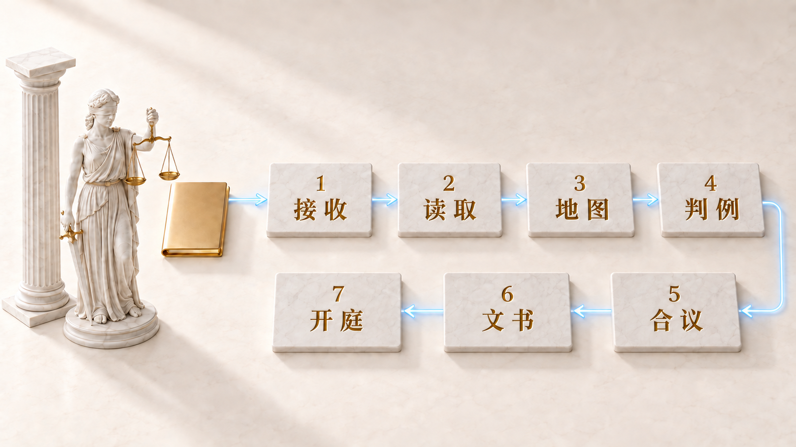

# Themiz：用对话完成安装

<p align="center"></p>

<!-- owner-greeting:start -->

你好。我是菲尔，一名律师。我为自己的执业实践创建了 Themiz。

我需要把案件材料、来源和草稿整理得井然有序。Themiz 将这些环节纳入同一工作流程，并设置独立复核。
法律立场和是否提交的决定由我作出。

接下来我会带你完成安装。每项操作前，我都会说明你的电脑会发生什么变化、需要哪些权限。
如果遇到问题，请在 Issues 中说明你运行了什么命令以及得到的响应。不要在那里附上委托人材料。

- 菲利普·扎鲁宾

<!-- owner-greeting:end -->

## 第 1 步：查看你的机器上已有的内容

**我在做什么：** 检查 macOS 版本、是否有 Python 3.11 或更高版本、Xcode 命令行工具，以及已安装的
智能体。我不安装任何内容，只做查看。

**为什么：** 扫描件识别依赖 Apple Vision，而它只在 Mac 上可用。现在知道，胜过安装到一半才发现。

**磁盘上会改变什么：** 什么都不改。这一步只读。

**你会得到：** 缺失组件清单及其安装方法。

**岔路：** 如果你没有 Mac，Apple Vision 就不可用。Windows 和 Linux 上的完整安装尚未验证。
我们可以单独检查你的系统能否提取文本，或改在 Mac 上继续。

## 第 2 步：安装依赖

**我在做什么：** 运行 `bash install.sh`。安装程序分为七步：Python 包、法院文书使用的 PT Serif
字体、Apple Vision 识别、用于转写录音的 ffmpeg、脚本权限、工作目录和智能体 CLI。

**为什么：** 这些组件用于提取文本和生成文书。处理音频还需要 ffmpeg 与本地 Whisper 模型。
本地操作不需要付费的模型 API。

**磁盘上会改变什么：** Python 包安装在项目的 `.venv` 中，字体安装在用户字体目录中，并创建工作目录
`cases/_logs`、`cases/_assets`、`knowledge` 和桌面上的收件箱目录。运行前，我会说明安装包含哪些内容。
所选智能体的访问权限和订阅需要另行配置。

**你会得到：** 安装程序报告。检查出错或超时会保留在报告中；仅成功安装软件包，不能说明所有外部服务
都已准备就绪。

## 第 3 步：选择启动方式

**我在做什么：** 用 `. .venv/bin/activate` 激活环境。你可在两个同等的客户端中选择：`codex` 或
`claude`。`code .` 会在编辑器中打开项目；`.venv/bin/python cockpit/app.py` 会启动本地浏览器面板。

**为什么：** 项目为 Codex CLI 和 Claude Code 都提供规则和角色。每个客户端都需要各自的模型访问权限
和可用的订阅额度。

**磁盘上会改变什么：** 选择客户端本身不改变项目设置。
客户端和面板可能会创建各自的日志、工作目录和本地状态。

**你会得到：** 用于 Themiz 工作的已选客户端。我会检查它是否能读取项目规则。

**岔路：** 如果你不允许模型提供商处理案件材料，我们就只使用本地提取和查看工具。智能体分析不是本地
OCR。浏览器面板中的任务启动按钮目前调用 Claude Code；Codex 任务请从它的 CLI 中运行。

## 第 4 步：建立第一个案件

**我在做什么：** 询问委托人和案件，依据既往案件登记表检查利益冲突，创建目录结构，并从收件箱移动材料。

**为什么：** 本地登记表有助于在开始工作前发现匹配项。程序不知道未登记的案件；利益冲突检查是否完整，
由你评估。

**磁盘上会改变什么：** 新建 `cases/{委托人}/{案件}` 目录，其中包含材料、草稿和完成文书的目录。
移动文件前，我们会确认文件组；接收后，不修改 `00_intake/` 中的原始文件。

**你会得到：** 案件卡和依据现有本地登记表得出的检查结果。

## 第 5 步：执行流程

**我在做什么：** 编制材料地图，检查允许来源是否可用，寻找支持你立场及反对你立场的论据，准备草稿，
并交由独立复核者审阅。工作量和评议组组成取决于案件的复杂程度。

**为什么：** 起草文书的人不能验收它。复核者读取磁盘内容，而不是起草者的报告；裁定由工具记录，
而不是由复核者写入。

**磁盘上会改变什么：** 案件地图、实践文件、立场文件、草稿和裁定日志都保存在案件目录内。
进行智能体分析时，所选模型提供商会处理发送给它的片段。发送材料前，我们会核查是否已获准进行这类处理。

**你会得到：** 草稿及其复核结果，或具体的停止原因。缺失的来源不视为已验证。签署和提交前，
你应自行核查文书。

<p align="center"></p>

## 第 6 步：确认一切正常运行

**我在做什么：** 运行工具自检，并用一条命令显示案件状态。

**为什么：** 承诺要么有效，要么无效。验证比相信更省事。

**磁盘上会改变什么：** 除运行日志外，什么都不改。

**你会得到：** 一份带退出码的工具清单，以及案件摘要：哪一步已完成、下一步是什么、哪里缺少材料。

如果已构建 `bin/vision-doc`（需要 macOS 26 或更新版本），运行 `./bin/vision-doc --selftest`。
如果只有 `vision-ocr` 可用，请用不含敏感数据的测试图片检查识别结果；
该工具没有 `--selftest` 参数。

```bash
python3 scripts/themiz_status.py cases/{委托人}/{案件} --brief
```
